# Voltex Pico - Sound Voltex Style Mini Controller
[点这里可以切换到中文版](README_CN.md)

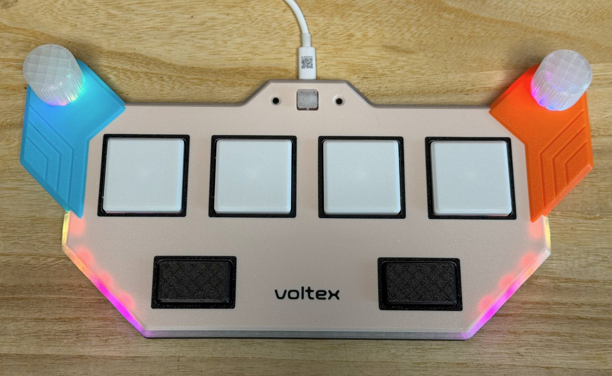

Features:
* It's ultra thin but closely replicates the feel of the arcade controller.
* Supports both Hall Effect (magnetic) switches and regular mechanical switches.
* Utilizing my new innovation: stabilizer mechanics for big and thin buttons.
* Hall Effect knobs.
* Full HID light support.
* Command line for configurations.
* All source files open.

Thanks to many respected guys/companies who made their tools or materials free or open source (KiCad, OnShape, InkScape, Raspberry things).

Special thanks to community projects and developers.
And also these projects:
* RP_Silicon_KiCad: https://github.com/HeadBoffin/RP_Silicon_KiCad
* Type-C: https://github.com/ai03-2725/Type-C.pretty

## My Other Projects
You can check out my other cool projects.

             

* Popn Pico: https://github.com/whowechina/popn_pico
* IIDX Pico: https://github.com/whowechina/iidx_pico
* IIDX Teeny: https://github.com/whowechina/iidx_teeny
* Chu Pico: https://github.com/whowechina/chu_pico
* Mai Pico: https://github.com/whowechina/mai_pico
* Diva Pico: https://github.com/whowechina/diva_pico
* AIC Pico: https://github.com/whowechina/aic_pico
* Groove Pico: https://github.com/whowechina/groove_pico
* Geki Pico: https://github.com/whowechina/geki_pico
* Musec Pico: https://github.com/whowechina/musec_pico
* Ju Pico: https://github.com/whowechina/ju_pico
* Bishi Pico: https://github.com/whowechina/bishi_pico
* Nos Pico: https://github.com/whowechina/nos_pico

## **Disclaimer** ##
I made this project in my personal time with no financial benefit or sponsorship. I will continue to improve the project. I have done my best to ensure that everything is accurate and functional, there's always a chance that mistakes may occur. I cannot be held responsible for any loss of your time or money that may result from using this open source project. Thank you for your understanding.

## About the License
It's CC-NC. So DIY for yourself and for your friend, don't make money from it. And plagiarism that doesn’t even dare to mention the original author is not acceptable. Please note that pooling orders and group buying for raw materials is acceptable. Selling off any leftover components without profit is also acceptable.

If you're interested in buying from me or some kind of commercial use, please contact me (Discord, QQ group, Wechat group or leave your contact in issue section).

## My Discord Invitation
https://discord.gg/M8f2PPQFEA

## HOW TO BUILD
### PCB and Components
* Go JLCPCB and make order with the gerber zip files (latest `Production\PCB\voltex_pico_xxx.zip`), regular FR-4 board, black or white color, **1.6mm** thickness.  
* 1x Rasberry Pico Pi Pico or pin-to-pin compatible clones (U1).  
  https://www.raspberrypi.com/products/raspberry-pi-pico
* 1x USB Type-C socket (918-418K2023S40001 or KH-TYPE-C-16P)
* 21x Reverse Mount WS2812B-3528 RGB LEDs (D1-D20).
* 18x WS2812B-4020 side emitting RGB LEDs (DL1-DL9, DR1-DR9).
* 2x TMAG-5273A1 or TMAG5273A2, in SOT23-6 (U3, U4).
* 50x 0603 0.1uF capacitors (all capacitors on the PCB, most of them are optional).
* 4x 0603 5.1kohm resistors (R1, R2, R3, R4).
* 12x U-shape 2U stabilizer steel wires, you can also harvest them from regular 2U MX stabilizers.
* 1x Kailh Choc switch for the START button (B7).
* 2x ALPS SKHHBVA010 or compatible (6\*6\*7mm) tactile switches for the AUX buttons (B8, B9).
* Some soft wires to connect the main PCB to the sensor PCBs.

* The following is for regular switch build.
  * 6x Kailh Choc low-profile switches. Choose heavy ones (70gf) for 4 BT buttons, and regular ones (50gf) for 2 FX buttons (B1-B6).

* The following is for Hall Effect switch build.
  * 1x ADG708BRUZ, 8 to 1 analog switch, in TSSOP-16 (U2).
  * 1x LM4040 Shunt Voltage Reference, get one with 2.0, 2.1, or 2.5 reference voltage, in SOT23-3 (U5).
  * 1x LP5907MFX-4.5 or TPS7A2042PDBVR LDO, in SOT23-5 (U7).
  * 6x SS49E or compatible linear Hall Effect sensors, in SOT23-3 (H1-H6).
  * 1x 10ohm resistor, 0603 (R5).
  * 1x 3.3V Zener diode, in SOD-123 or SOD-123F, such as BZT52H-C3V3 (Z1).
  * 6x low profile magnetic switches, Gateron/NuPhy Jade Mini or Jade Pro Mini, or Kailh Star Magnetic Mini. (B1-B6).
  * 4x heavy springs (60gF+) for low-profile switches, to replace the original ones in 4 BT switches. You may buy or harvest them from Kailh Choc heavy switches.

* This picture shows a soldered PCB (there might be changes in newer versions of PCB). It's a Hall Effect switch build.  
  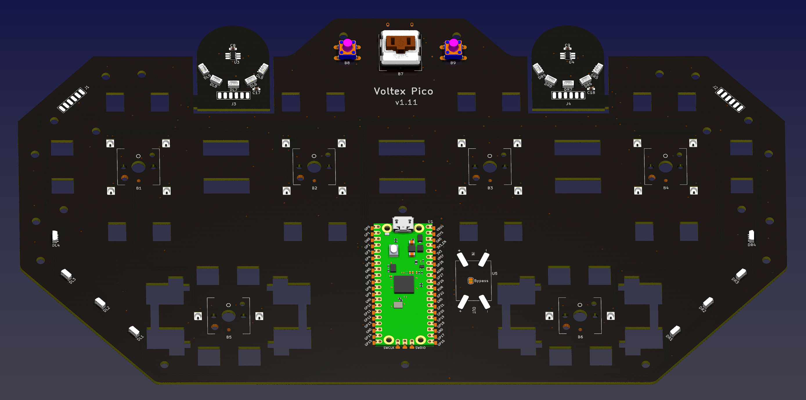  
  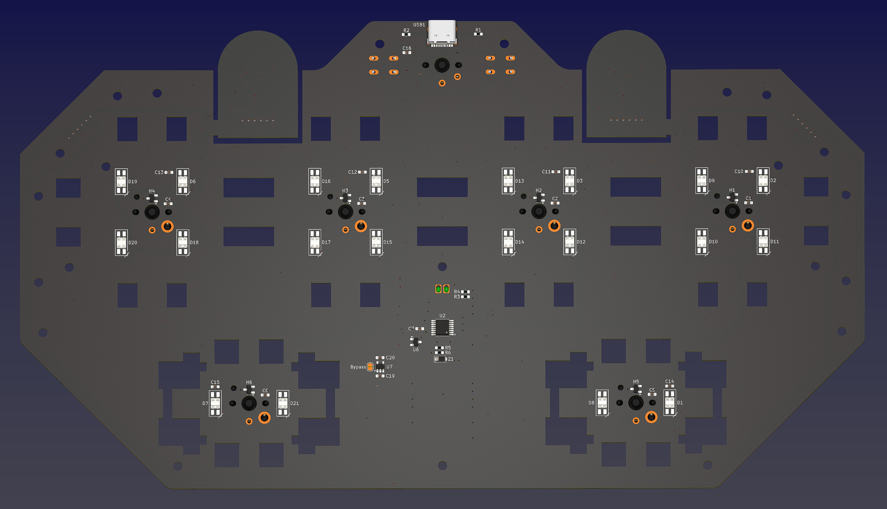

### Important Tips for Soldering
* Be careful of 2 pin holes. It's a common oversight to either forget to solder them or to leave air bubbles during the process. To avoid this, solder slowly from one side of the hole, using minimal solder wire and a generous amount of flux.
* Reverse mount LEDs are soldered at the bottom side of the PCB.
* D4 actually requires a regular WS2812B-3528 RGB LED, not a reverse mount one. We can make one from a reverse mount one. Just bend the 4 feet to the bottom and it becomes a regular WS2812B-3528.  
  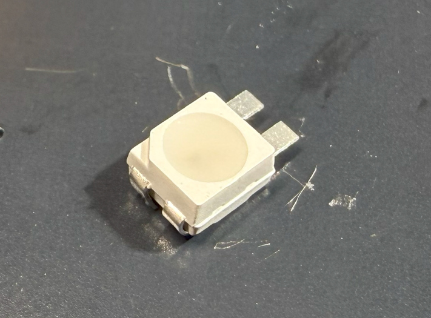
* Be careful with WS2812B-4020 orientation. DL1 to DL4, and DR1 to DR4 are side facing, while the DL5 to DL9 and DR5 to DR9 are top facing. 
* Leave the DCDC (U5) empty and short the corresponding BYPASS jumper.
* You don't need to solder all the capacitors, it's fine to just solder the ones right beside ICs.
* Z1 is to protect the Pico from excessive voltage, don't ignore it.
* There are many LDOs and shunt voltage reference models, as long as they have the same form factor, pinout and voltage, you can use them. Best LDO voltages are 4.0 to 4.5V, they should not go higher than 4.5V, as the USB voltage under load could be lower than it. The shunt voltage reference should be 2.0 to 2.5V, roughly half of the LDO voltage.
* For regular switch build, you need to solder the switches onto the PCB. For Hall Effect switch build, you don't need to solder the switches, just make sure the magnets are aligned with the small white circles on the PCB.

### Test the PCB
* You can test the PCB now, put the firmware in.
* Side LEDs and Knob LEDs should light up in a rainbow pattern.
* Button LEDs respond to the button presses (magnetic switches need to be temporarily put on and calibrated).
* Voltex Pico should be recognized as a USB HID device, here's the test page.  
  https://greggman.github.io/html5-gamepad-test/
* Move a magnetic screwdriver tip close to the TMAG5273 sensor, you'll notice the corresponding axis move in the test page. Please check both sensors.

### Sensor PCB Separation and Soldering
* If everything works fine, you can cut off (or even bend and snap) 2 small sensor boards from the main board.
* Solder short flexible wires to connect the main PCB and sensor PCBs.  
  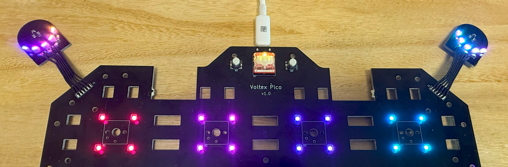

### 3D Printing
#### Printing parameters  
* PLA or PETG.
* Layer height: 0.2mm
* Support: No, unless mentioned.
* Files are always in millimeter unit, not inch.

#### 2x Knob Parts
* Knob: `Production\3DPrint\* - Knob.stl`, clear, semi-transparent. Print it upside down. 
* Bearing Fixer: `Production\3DPrint\* - Bearing Fixer.stl`.
* Magnet Seat: `Production\3DPrint\* - Magnet Seat.stl`.

#### Button Parts
For regular switch build, choose Choc V1 or Choc v2 keycaps according to your switch type. For Hall Effect switch build, always choose Choc V2 ones.
**For all button keycaps, print them upside down.**

* Main BT: `Production\3DPrint\* - BT Choc V?.stl`, white.
* FX BT: `Production\3DPrint\* - FX-? Choc V?.stl`, smokey transparent. Support required.
* Start: `Production\3DPrint\* - START Choc V?.stl`, clear, semi-transparent.

#### Wing Parts
* Wing Base: `Production\3DPrint\* - * Wing Base.stl`, black.
* Wing Cover: `Production\3DPrint\* - * Wing Cover.stl`, cyan for the left, orange for the right. Print it upside down.

### Housing Parts
* Base: `Production\3DPrint\* - Base.stl`, black.
* Support: `Production\3DPrint\* - Support.stl`, clear, semi-transparent.
* Panel: `Production\3DPrint\* - Panel Combo.3mf`, white or close-to-white, with logo and patterns in black if you have multi-color system. Print it upside down.  

### Thin Stabilizing Mechanism for Big Button 
Before assembly, I'm going to introduce a new thin stabilizing mechanism for big buttons. I designed it so a slim Voltex Pico is possible.

Stabilizing a button means to make the button not wobble when pressed. A wobbling button is like a seesaw, corners for the button don't go up and down in sync, which makes the button feel bad and not reliable.

Stabilizing a big button is never a problem for arcade, simply because arcade cabs have enough vertical space. They can use so called "tube guide" stabilizing. As long as the tube is long enough (versus the gap between the tube and the shaft), buttons can only move or twist horizontally a little bit, but never wobble like a seesaw. 

Technically, for a slim controller which only has millimeters of vertical space, we can still use tube guide, but such a small tube and shaft will be very difficult to make or harvest, not to mention the sliding surface material. In short words, it's not feasible for DIYers. So we have to use a lever based stabilizing mechanism, like we do in the modern keyboards.

Long keyboard keycaps are "1-dimensional", you only need one stabilizer on their X-axis. But for big arcade buttons - big cicle or square - they need "2-dimensions" of stabilizing. So people just drop in 2 stabilizers, placed perpendicular to each other. Technically this will work. But there come new problems.
  * Vertical space for the stem and the stabilizer is not ideal for a slim controller.
  * Requires accurate keycap stem holes (connecting both the keyswitch and the stabilizer), tiny misalignment can cause stress and bring excessive friction.
  * Both FDM and SLA 3D printing have their own tolerances, which can cause misalignment easily.

So here I'm introducing my way.
First of all, I'm still using a lever-based stabilizing, just like the one in keyboards. A keyboard stabilizer has a U-shape steel lever which stays in two housing units (we call them "stabilizer base"). It rotates around its shaft side and drives two connectors (stems) to move up and down simultaneously.

My change is, remove the housing units and the stems, let the U-shape steel lever drive the keycap directly. With the stems removed, coupling of the keycap and the lever is much more lenient to misalignment; with the housing units removed, the vertical space is much smaller, which is ideal for a slim controller.

The "bearing" for the lever is printed along with the the bottom housing. The keycaps have small holes for the lever arms to go through. A FDM 3D printer can print them easily.

  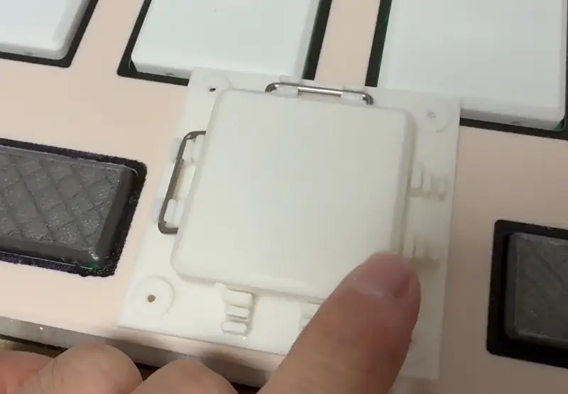

The Voltex Pico uses this new stabilizing mechanism for the big BT buttons as well as the FX buttons.

### Assembly
#### Other components needed
* 6x **M2.5\*(14mm-18mm) screws** for fixing the magnet seat to the knob.
* 8x **M2\*6mm screws** for fixing the bearing (bearing fixer to the wing cover).
* 6x **M2\*(8mm-10mm) screws** for fixing wing bases to the wing cover.
* 12x **M3\*(4mm-5mm) screws** for fixing the PCB to the base parts.
* 10x **M3\*(8mm-10mm) screws** for fixing the base, wing base, support and the panel.
* 2x 6702zz (15x21x4mm) bearings for the knobs.
* 2x round magnets, 5mm diameter, 1.5mm or 2mm tall, MUST be radially/diametrically magnetized (N-S poles on the curved side).
* Some thin tape (such as acetate tape or high-temp teflon tape) to fix the magnets in place.
* Some 10mm diameter silicone anti-slip pads for the bottom.  
* Some 1mm thick soft felt sheet for damping the knobs.

#### Steps
1. We'll start with the bearings. They should be inserted into wing parts. Fix them using bearing fixers and M2\*6mm screws.  
   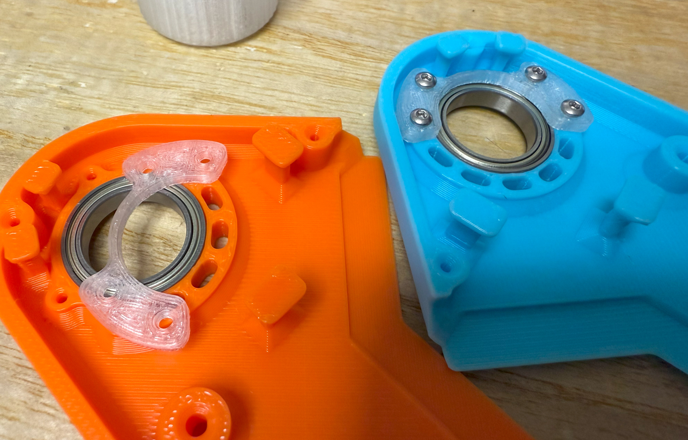

2. Cut a ring from the soft felt sheet to dampen the knob. If you feel this is too difficult, you can apply some layers of felt between the knob and the sensor PCB, it works too.   
   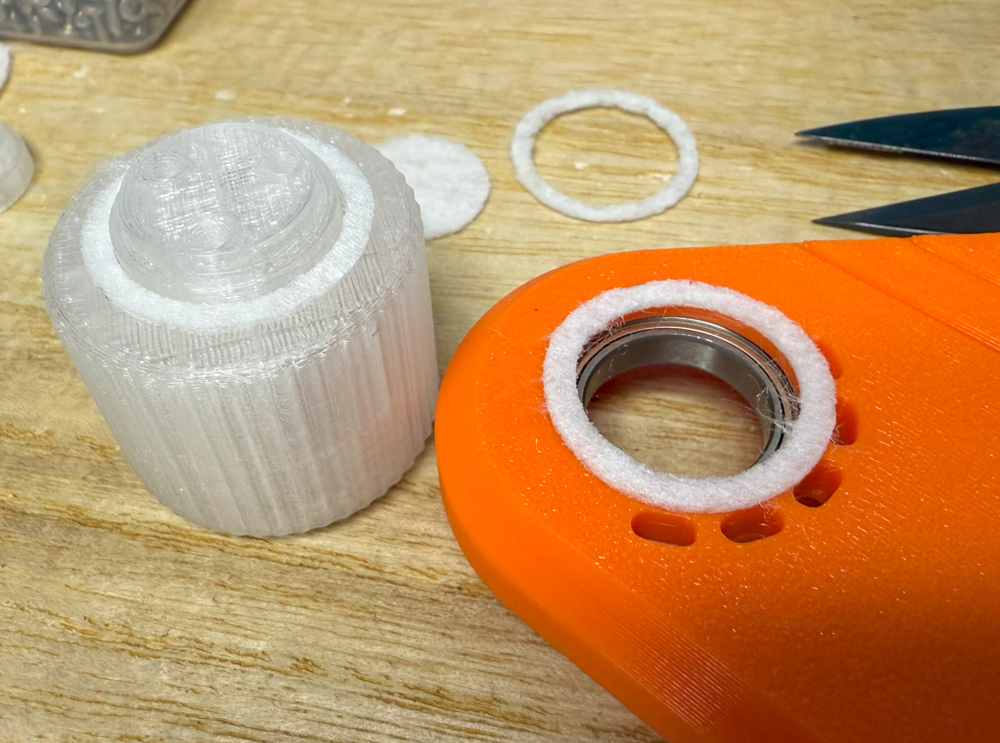

3. Fix the knob to the bearing with the magnet set and the M2.5 screws (long screws help reinforce the knob shaft). Then put the magnet into the center seat. If you have some thin tape, apply it as a seal so magnet won't fall out.  
   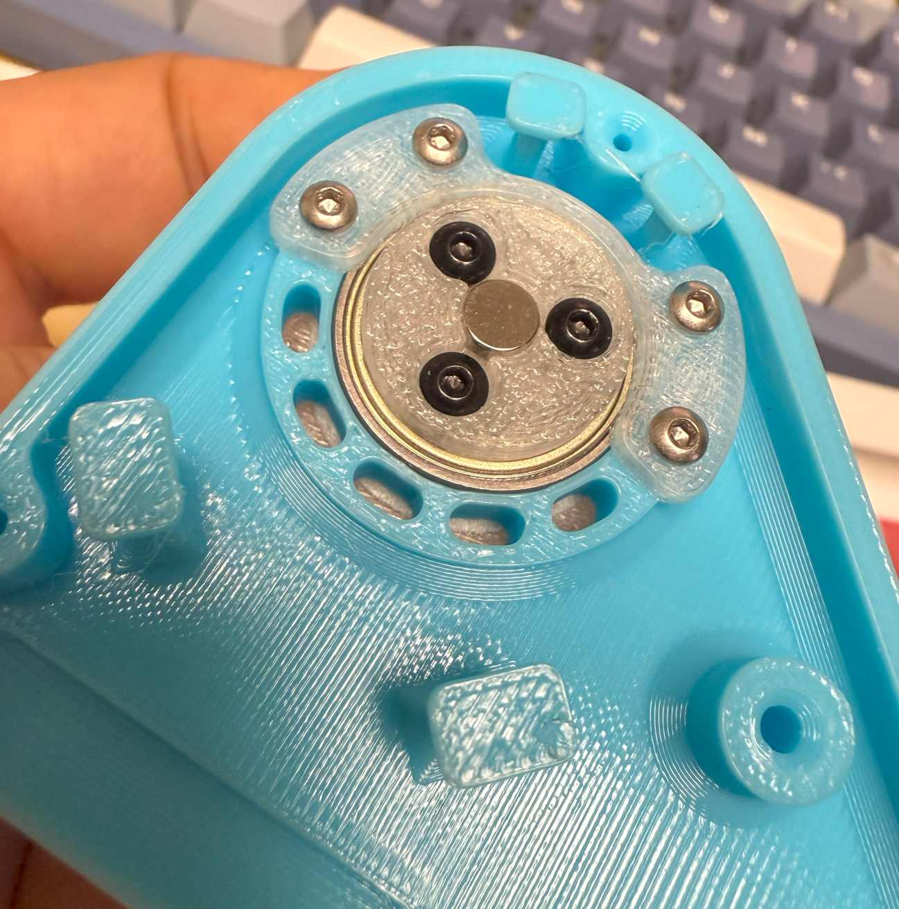 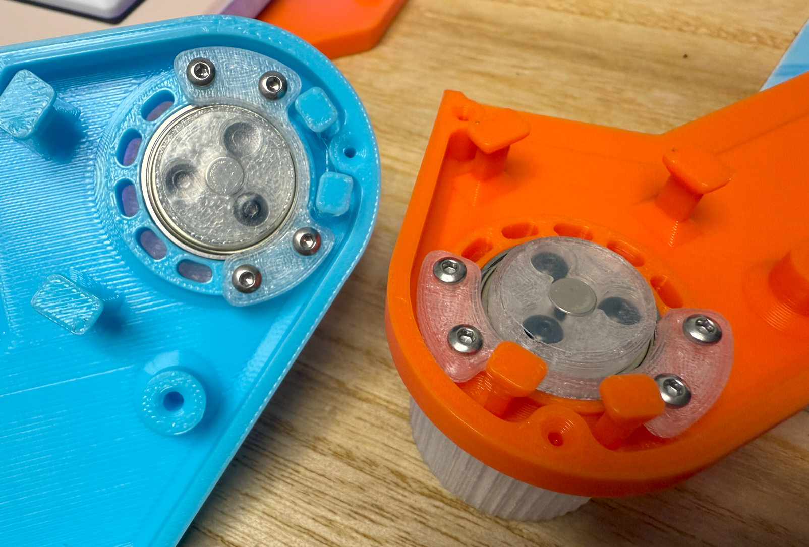

4. Put the main PCB into the base part, and sensor PCBs into the wing base parts. Use M3\*(4mm-5mm) screws to fix the PCB to the base parts.  
   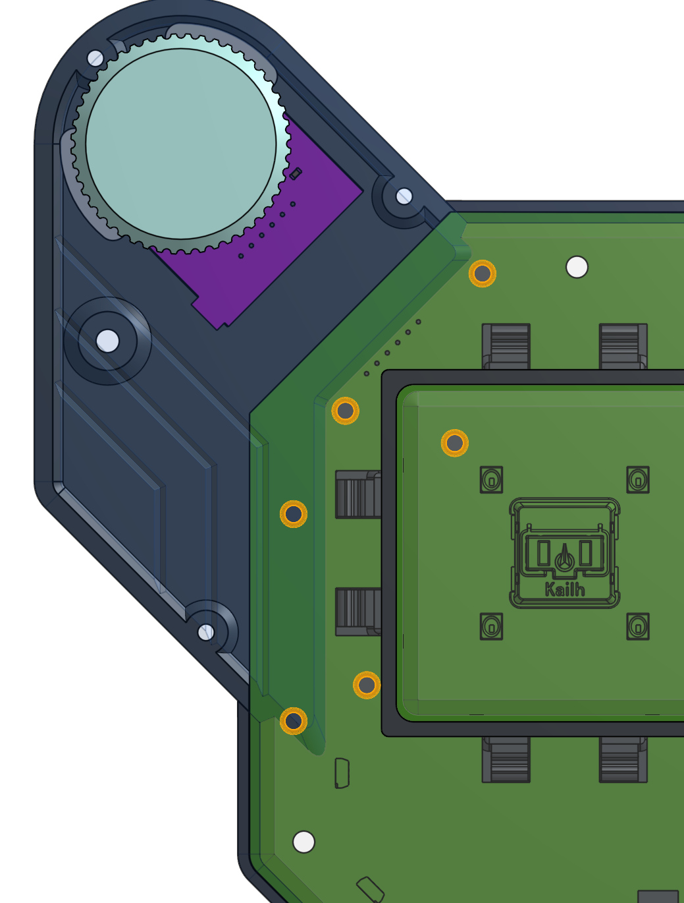 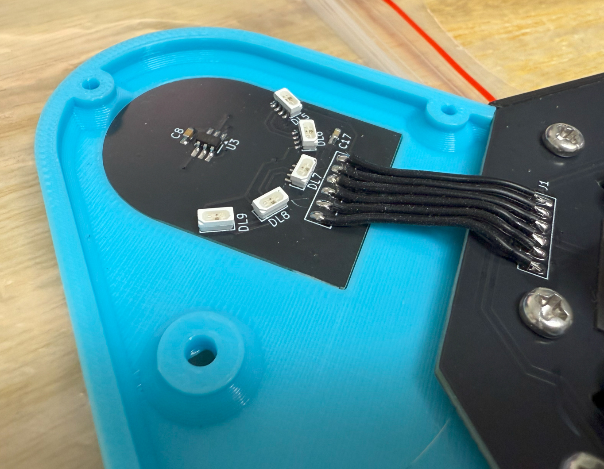

5. Time to install keycaps to the stabilizer. It's simple, just look at the pictures. You can apply some thin poron pads to dampen the keycap noise, but it's not necessary. Some lubricant can be applied to the lever shaft, this makes the movement smoother. For Hall Effect version, you can use 704 RTV silicone to stick the switches to the PCB, or not - it's totally fine.  
   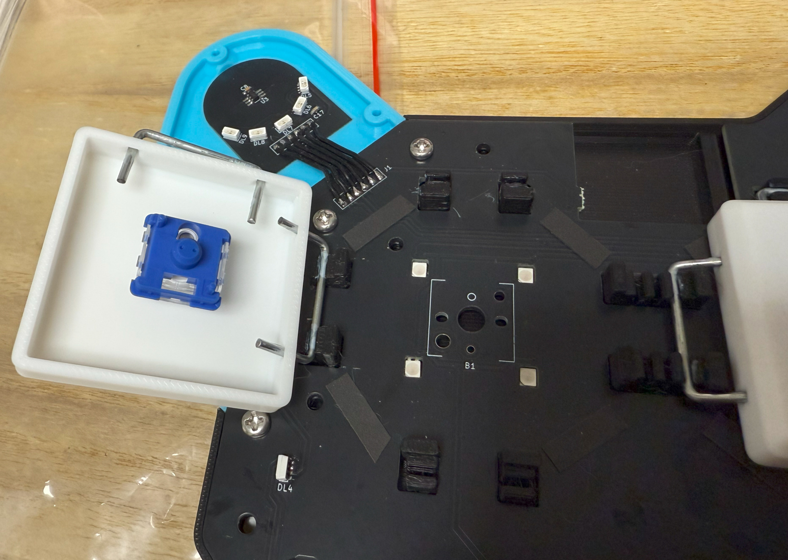  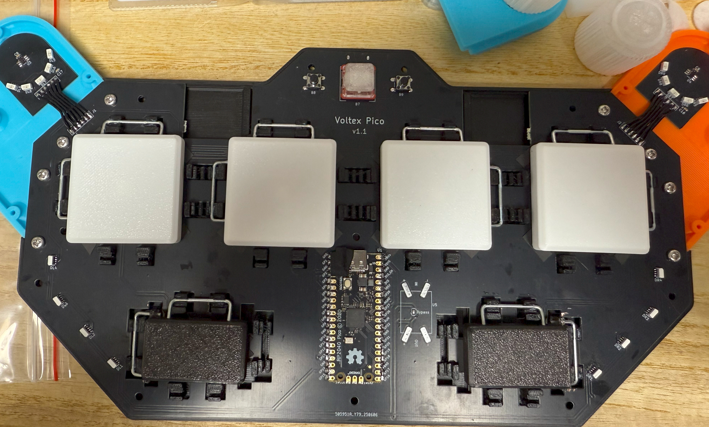

6. Put on the support and the panel. Use M3\*(8mm-10mm) screws to fix the base. Leave the two screws on the wing base empty for now.

7. Put on the wing covers (which already have knobs on them), use M2\*(8mm-10mm) screws to fix them to the wing cover (see the picture for M2 screws). And use M3\*(8mm-10mm) screws on the remaining screw holes (one at each side). Apply silicone pads, they don't look nice but they prevent the controller from sliding on the table.   
   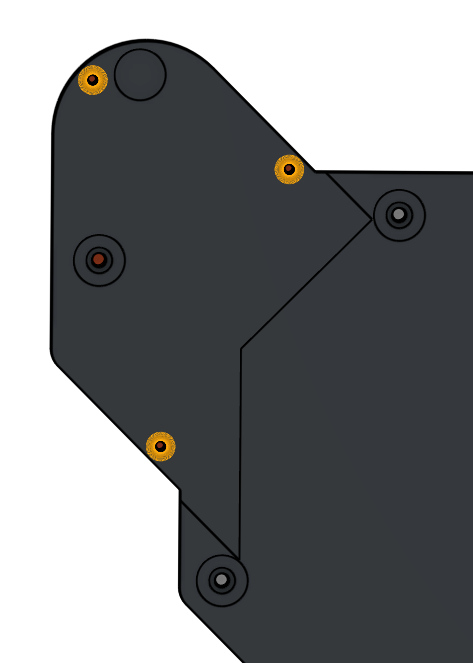 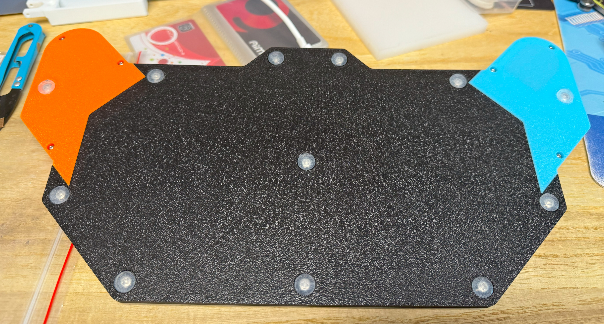
   
8. Congratulations! You have finished the assembly.  
   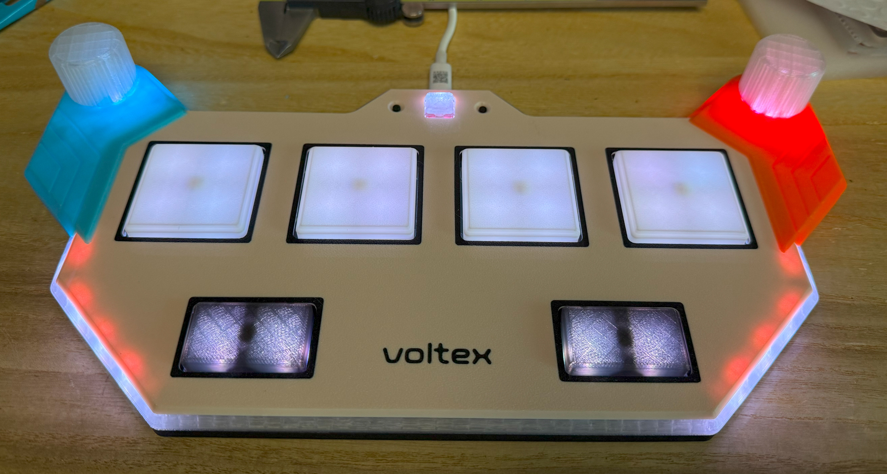

#### Caution
* Each 3D printer and filament has its own tolerance. If you find the holes on the keycap are too tight, use a needle or knife to enlarge them a little bit.
* Screws are easy to break the 3D printed parts. So don't screw them too tight. When you notice the resistance suddenly increases, stop screwing.

### Firmware
* UF2 file is in `Production\Firmware` folder.
* For the new build, hold the BOOTSEL button while connect the USB to a PC, there will be a disk named "RPI-RP2" show up. Drag the UF2 firmware binary file into it. That's it. There's a small hole at the bottom side, it is facing right to the BOOTSEL button.
* If it's already running Voltex Pico firmware, you can either use "update" in command line or hold down at least 4 buttons while connecting to USB to enter update mode.
* To access the command line, you can use this Web Serial Terminal to connect to the USB serial port of the controller. (Note: "?" is for help)  
  https://googlechromelabs.github.io/serial-terminal/

### Usage
* If you built a Hall Effect switch version, you need to calibrate first (`calibrate` command). You can set trigger and reset point in command line.
* Just plug it in and play.
* You can set knob resolution by `knob rate` command.
* You can set trigger and reset point by `trigger` command (only for Hall Effect switch version).

## CAD Source File
I'm using OnShape free subscription. It's powerful but it can't archive original designs to local, so I can only share the link here. All model files are exported from this online document.  
  https://cad.onshape.com/documents/757c9485a30088ef0335481e/w/af98e079c47cba7d81086e65/e/9703cb81cc6ed9c6ec563897
