# Voltex Pico - Sound Voltex 风格的迷你控制器
[点击这里查看英文版本](README.md)

特性：
* 超薄设计，但尽量复刻街机控制器的手感。
* 支持霍尔效应（磁性）开关和普通机械开关。
* 采用我的最新设计：大型按键的平衡机制。
* 霍尔效应旋钮。
* 全面支持 HID 灯光。
* 命令行配置。
* 所有源文件开放。

感谢许多令人尊敬的爱好者和公司将他们的工具或材料免费或开源（KiCad，OnShape，InkScape，Raspberry 相关工具, 嘉立创，等）。

特别感谢社区项目和开发者的帮助，还有如下项目：
* RP_Silicon_KiCad: https://github.com/HeadBoffin/RP_Silicon_KiCad
* Type-C: https://github.com/ai03-2725/Type-C.pretty

## 其他项目
你也可以查看我其他的酷炫项目。

             

* Popn Pico: https://github.com/whowechina/popn_pico
* IIDX Pico: https://github.com/whowechina/iidx_pico
* IIDX Teeny: https://github.com/whowechina/iidx_teeny
* Chu Pico: https://github.com/whowechina/chu_pico
* Mai Pico: https://github.com/whowechina/mai_pico
* Diva Pico: https://github.com/whowechina/diva_pico
* AIC Pico: https://github.com/whowechina/aic_pico
* Groove Pico: https://github.com/whowechina/groove_pico
* Geki Pico: https://github.com/whowechina/geki_pico
* Musec Pico: https://github.com/whowechina/musec_pico
* Ju Pico: https://github.com/whowechina/ju_pico
* Bishi Pico: https://github.com/whowechina/bishi_pico
* Nos Pico: https://github.com/whowechina/nos_pico

## **声明** ##
我在个人时间内制作了这个项目，没有任何经济利益或赞助。我将继续改进这个项目。我已尽我所能确保所有内容的准确性和功能性，但总有可能出现错误。如果你因使用这个开源项目而造成时间或金钱的损失，我不能负责。感谢你的理解。

## 关于许可证
它是 CC-NC 授权。所以你只能给自己和你的朋友 DIY，不能利用这个项目赚钱，比如收费的代做，出售整机等，连源作者都不敢提的抄袭或者稍微改改换个名字来打擦边球就更不可以了。注意团购和拼单订购原始元器件是合理的，非盈利的方式卖掉剩余的元器件也是可以接受的。

如果希望找我购买成品或者寻求商用授权，请联系我（Discord，QQ 群，闲鱼，微信群或者在 issue 区留下你的联系方式）。

## 我的 Discord 服务器邀请
https://discord.gg/M8f2PPQFEA

## 如何制作
### PCB 和组件
* 前往 JLCPCB 使用 gerber zip 文件下单（最新的 `Production\PCB\voltex_pico_xxx.zip`），常规 FR-4 板材，黑色或白色，**1.6mm** 厚度。
* 1x 树莓派 Pico 或引脚兼容的克隆板 (U1)。  
  https://www.raspberrypi.com/products/raspberry-pi-pico
* 1x USB Type-C 插座 (918-418K2023S40001 或 KH-TYPE-C-16P)
* 21x 反向贴装 WS2812B-3528 RGB LED (D1-D20)。
* 18x WS2812B-4020 侧发光 RGB LED (DL1-DL9, DR1-DR9)。
* 2x TMAG-5273A1 或 TMAG5273A2，SOT23-6 封装 (U3, U4)。
* 50x 0603 0.1uF 电容（PCB 上所有电容，大部分是可选的）。
* 4x 0603 5.1kohm 电阻 (R1, R2, R3, R4)。
* 12x U 形状的 2U 卫星轴钢丝，也可以从普通 2U MX 卫星轴里拆。
* 1x 凯华 Choc 矮轴用于 START 按钮 (B7)。
* 2x ALPS SKHHBVA010 或兼容的（6\*6\*7mm）轻触开关用于 AUX 按钮 (B8, B9)。
* 一些软线用来连接主 PCB 和传感器 PCB。

* **以下仅适用于常规机械轴版本。**
  * 6x 凯华 Choc 矮轴。4 个 BT 按钮选择重力轴（70gf），2 个 FX 按钮选择常规力度的轴（50gf）(B1-B6)。

* **以下仅适用于霍尔效应（磁轴）版本。**
  * 1x ADG708BRUZ，8 选 1 模拟开关，TSSOP-16 封装 (U2)。
  * 1x LM4040 并联电压基准，请选用 2.0V、2.1V 或 2.5V 基准电压的型号，SOT23-3 封装 (U5)。
  * 1x LP5907MFX-4.5 或 TPS7A2042PDBVR LDO（低压差稳压器），SOT23-5 封装 (U7)。
  * 6x SS49E 或兼容的线性霍尔效应传感器，SOT23-3 封装 (H1-H6)。
  * 1x 10ohm 电阻，0603 封装 (R5)。
  * 1x 3.3V 稳压二极管（齐纳管），SOD-123 或 SOD-123F 封装，如 BZT52H-C3V3 (Z1)。
  * 6x 矮磁轴，佳达隆/NuPhy 的磁玉 Mini 或者磁玉 Pro Mini，或凯华的星磁 Mini 都可以。(B1-B6)。
  * 4x 矮轴用的重弹簧（60gF+），用来替换 4 个 BT 主按钮的磁轴的原装弹簧。可以单独购买或从凯华 Choc 重力矮轴里拆。

* 这张图片显示了焊接好的 PCB（较新版本的 PCB 可能有变化），展示的是磁轴版本。  
  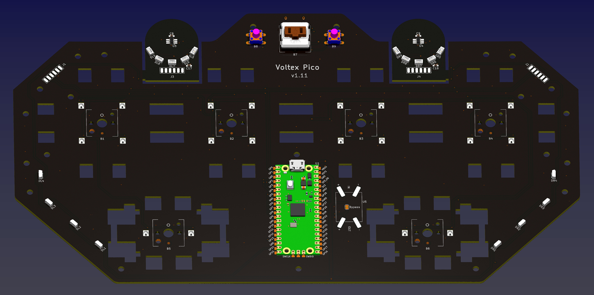  
  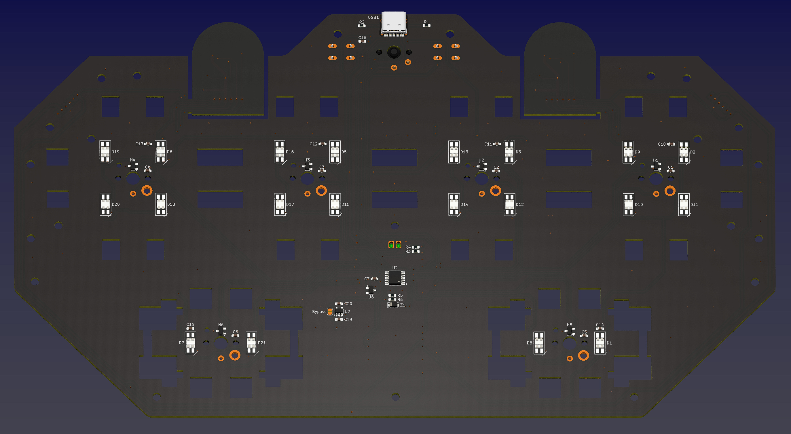

### 重要焊接提示
* 注意 2 个过孔。忘记焊接或在过程中留下气泡是常见的疏忽。为避免这种情况，从孔的一侧慢慢焊接，使用最少的焊丝和大量助焊剂。
* 反向贴装 LED 焊接在 PCB 的底面。
* D4 实际上需要常规 WS2812B-3528 RGB LED，而不是反向贴装的。我们可以从反向贴装的制作一个。只需将 4 个引脚弯到底部，它就变成了常规 WS2812B-3528。  
  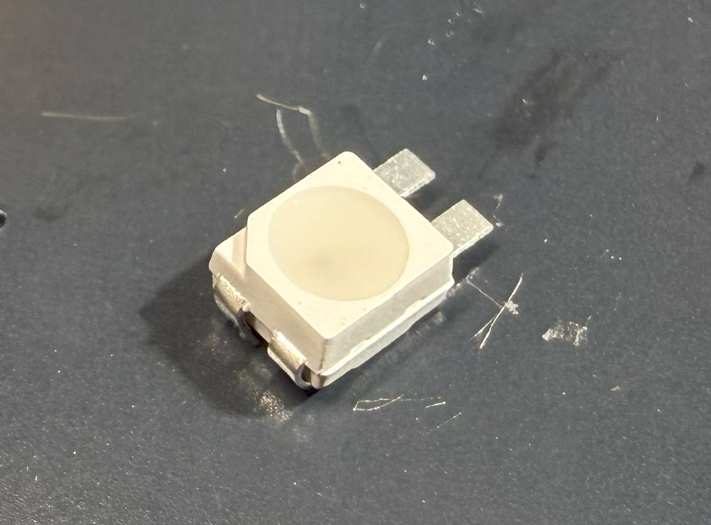
* 注意 WS2812B-4020 的方向。DL1 到 DL4 和 DR1 到 DR4 是侧面发光，而 DL5 到 DL9 和 DR5 到 DR9 是顶部发光。
* DC/DC (U5) 空着不焊，但要短接放在相同位置的 BYPASS 跳线。
* 您不需要焊接所有电容，只焊接 IC 旁边的那些就可以了。
* Z1 用于保护 Pico 免受过高电压影响，不要忽视它。
* 有很多 LDO 和并联基准电压型号，只要它们具有相同的封装、引脚和电压，您就可以使用它们。最佳 LDO 电压为 4.0 到 4.5V，不应超过 4.5V，因为负载下的 USB 电压可能会更低。并联基准电压应为 2.0 到 2.5V，大约是 LDO 电压的一半。
* 普通机械轴需要把轴体焊接到 PCB 上，但是磁轴不需要，磁轴只需要关注磁铁对准 PCB 上面的小白圆圈。

### 测试 PCB
* 现在可以测试 PCB，先烧录固件进去。
* 侧面 LED 和旋钮 LED 应以彩虹模式点亮。
* 按钮 LED 会响应按钮按压（磁轴需要临时把轴体上去并校准）。
* Voltex Pico 应被识别为 USB HID 设备，这里是测试页面。  
  https://greggman.github.io/html5-gamepad-test/
* 将磁性螺丝刀尖端靠近 TMAG5273 传感器，您会注意到测试页面中相应的轴会移动。两个传感器都测试一下。

### 传感器 PCB 分离和焊接
* 如果一切正常，您可以从主板上切断（甚至直接掰下来）2 个小传感器板。
* 用较短的软电线把主 PCB 和传感器 PCB 连接起来。  
  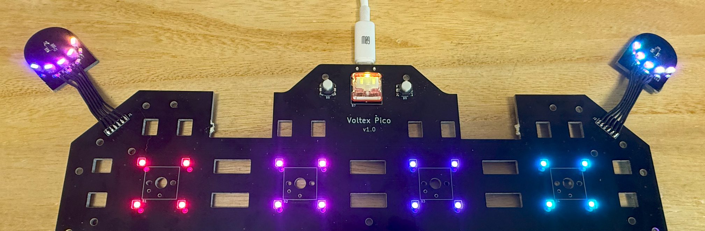

### 3D 打印
#### 打印参数
* PLA 或 PETG。
* 层高：0.2mm
* 支撑：否，除非另有说明。
* 文件始终使用毫米单位，而非英寸。

#### 2x 旋钮部件
* 旋钮：`Production\3DPrint\* - Knob.stl`，透明，半透明。倒置打印。
* 轴承固定器：`Production\3DPrint\* - Bearing Fixer.stl`。
* 磁铁座：`Production\3DPrint\* - Magnet Seat.stl`。

#### 按钮部件
对于常规机械轴版本，根据您的轴体类型选择 Choc V1 或 Choc v2 键帽。对于磁轴版本，始终选择 Choc V2。
**所有按钮键帽都倒置打印。**

* 主 BT：`Production\3DPrint\* - BT Choc V?.stl`，白色。
* FX BT：`Production\3DPrint\* - FX-? Choc V?.stl`，烟雾透明。需要支撑。
* Start：`Production\3DPrint\* - START Choc V?.stl`，透明，半透明。

#### 侧翼部件
* 侧翼底座：`Production\3DPrint\* - * Wing Base.stl`，黑色。
* 侧翼盖：`Production\3DPrint\* - * Wing Cover.stl`，左侧青色，右侧橙色。倒置打印。

#### 外壳部件
* 底座：`Production\3DPrint\* - Base.stl`，黑色。
* 支撑：`Production\3DPrint\* - Support.stl`，透明，半透明。
* 面板：`Production\3DPrint\* - Panel Combo.3mf`，白色或接近白色，如果有多色系统，logo 和图案用黑色。倒置打印。

### 大按钮的超薄平衡机制
在组装之前，我要这种适用于大按钮的超薄平衡机制。我设计它的初衷是让超薄的 Voltex Pico 成为可能。

平衡的意思是按钮在按下时不会摇摆。摇摆的按钮就像跷跷板，按钮的几个角落不能同步上下移动，这使得按钮手感不好且不可靠。

街机来说平衡从来都不是问题，因为街机框有足够的垂直空间。它们可以使用"导管"的按钮平衡机制。只要管子足够长（相对于管子和轴之间的间隙），按钮只会在水平方向上轻微移动或旋转，但绝不会像跷跷板一样摇摆。

从技术上讲，对于只有几毫米垂直空间的超薄控制器，我们仍然可以使用导管平衡技术，但如此小的管子和轴会很难制作或买到，更不用说滑动表面材料了。简单说就是对 DIY 而言是行不通的。所以我们必须使用基于杠杆的平衡机制，就像现代键盘那样。

键盘的长键帽只是"一维"的，它只需要在其 X 轴上有一个平衡轴（卫星轴）。但大型的街机按钮，它们一般是圆的或者方，它们需要"二维"平衡。所以有些爱好者用 2 个平衡轴，彼此垂直放置。从技术上讲这会起作用，但有些问题。
  * 轴芯和卫星轴的垂直空间占用对于超薄控制器来说不理想。
  * 需要精确的键帽轴芯孔（连接轴体和卫星轴），微小的错位可能会造成应力并带来过大的摩擦阻尼。
  * FDM 和 SLA 3D 打印都有自己的公差，很容易造成错位。

所以在这里我介绍我的方式。
首先，我仍然使用基于杠杆的平衡，就像键盘中的那样。传统键盘卫星轴里有一个 U 型的钢丝，它安装到两个外壳单元中（我们称之为"卫星轴座"）。它围绕其轴侧旋转并驱动两个连接器（轴芯）同时上下移动。

我的方案是，移除外壳单元和轴芯，让 U 型钢丝直接驱动键帽。移除轴芯后，键帽和杠杆的耦合对错位更加宽容；移除外壳单元后，垂直空间占用更小，对超薄控制器来说非常理想的。

给钢丝用的"轴承"是直接随着底部外壳打印。键帽则有小孔供杠杆臂穿过。FDM 3D 打印机可以轻松打印它们。

  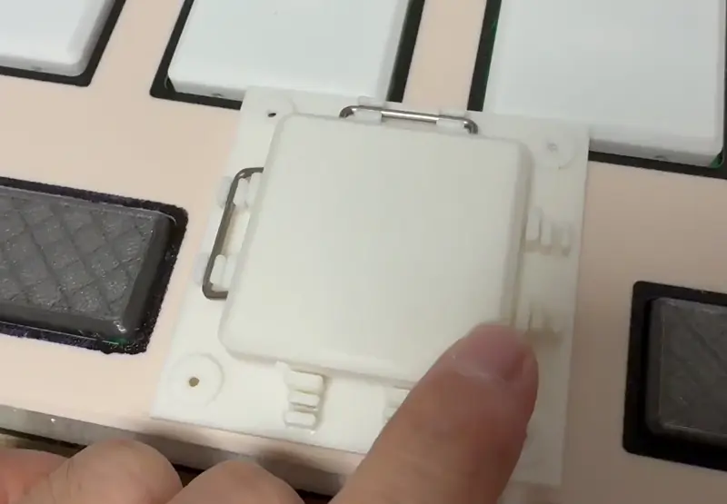

Voltex Pico 的大 BT 按钮以及 FX 按钮都用了这种新的平衡机制。

### 组装
#### 需要的其他组件
* 6x **M2.5\*(14mm-18mm) 螺丝** 用于将磁铁座固定到旋钮。
* 8x **M2\*6mm 螺丝** 用于固定轴承（轴承固定器到侧翼盖）。
* 6x **M2\*(8mm-10mm) 螺丝** 用于将侧翼底座固定到侧翼盖。
* 12x **M3\*(4mm-5mm) 螺丝** 用于将 PCB 固定到底座部件。
* 10x **M3\*(8mm-10mm) 螺丝** 用于固定底座、侧翼底座、支撑和面板。
* 2x 6700zz (10x15x4mm) 轴承用于旋钮。
* 2x 圆形磁铁，5mm 直径，1.5mm 或 2mm 高，必须是径向/直径磁化（N-S 极在弯曲侧）。
* 一些薄胶带（如醋酸胶带或高温特氟龙胶带）将磁铁固定到位。
* 一些 10mm 直径硅胶防滑垫用于底部。
* 一些 1mm 厚的软毛毡布用于阻尼旋钮。

#### 步骤
1. 我们从轴承开始，把轴承装到侧翼盖，使用轴承固定固定器和 M2\*6mm 螺丝把它们固定。  
   

2. 从软毛毡布上剪一个环，用来给旋钮提供阻尼。如果您觉得这太困难，可以在旋钮和传感器 PCB 之间放几层毛毡层，也有效。   
   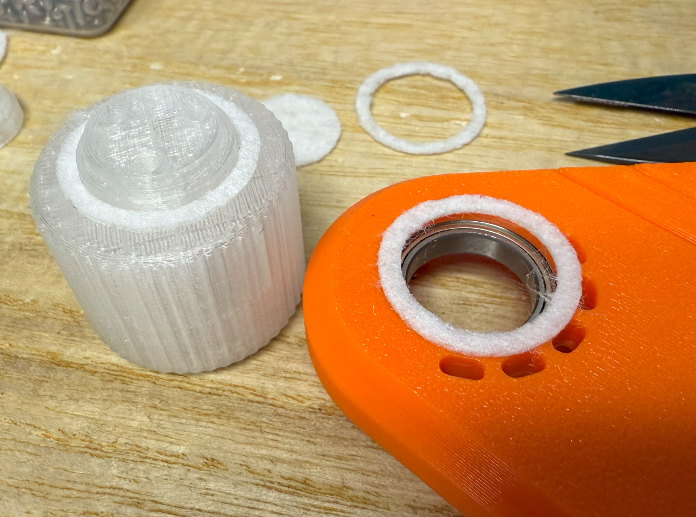

3. 用磁铁座和 M2.5 螺丝将旋钮固定到轴承（长螺丝是为了加固旋钮轴）。然后将磁铁放入中心座。如果您有一些薄胶带，贴上面封住，这样磁铁就不会掉出来。  
    

4. 将主 PCB 放入底座部件，将传感器 PCB 放入侧翼底座部件。使用 M3\*(4mm-5mm) 螺丝将 PCB 固定到底座部件。  
   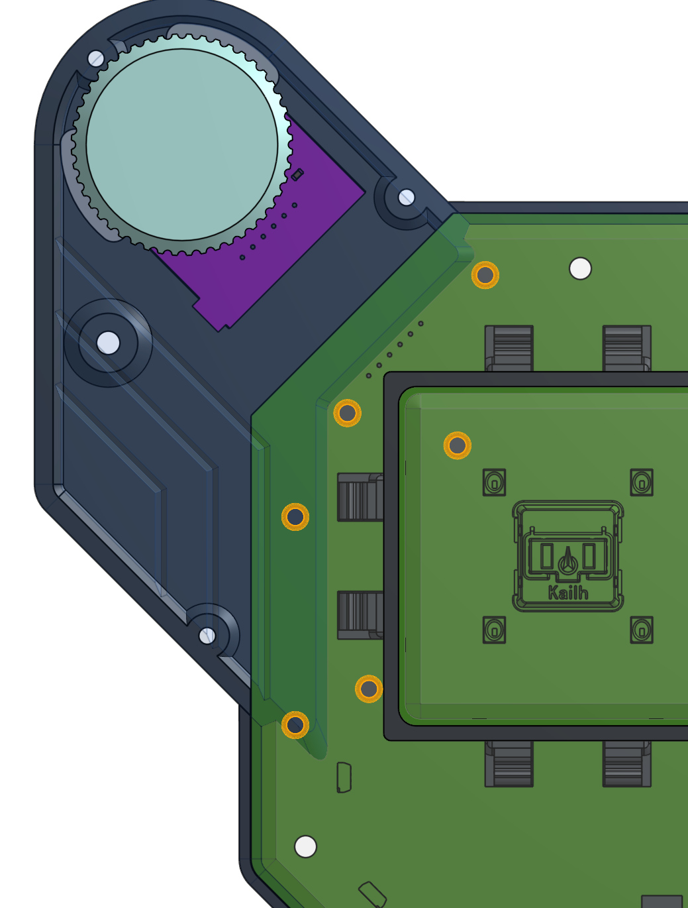 

5. 是时候安装键帽和平衡结构了。很简单，直接看图片吧。您可以应用一些薄的泡棉垫来阻尼键帽噪音，但这不是必需的。润滑一下钢丝会让运动更平滑。对于磁轴版本，磁轴可以用硅橡胶粘到 PCB 上，但不粘也是完全可以的。  
    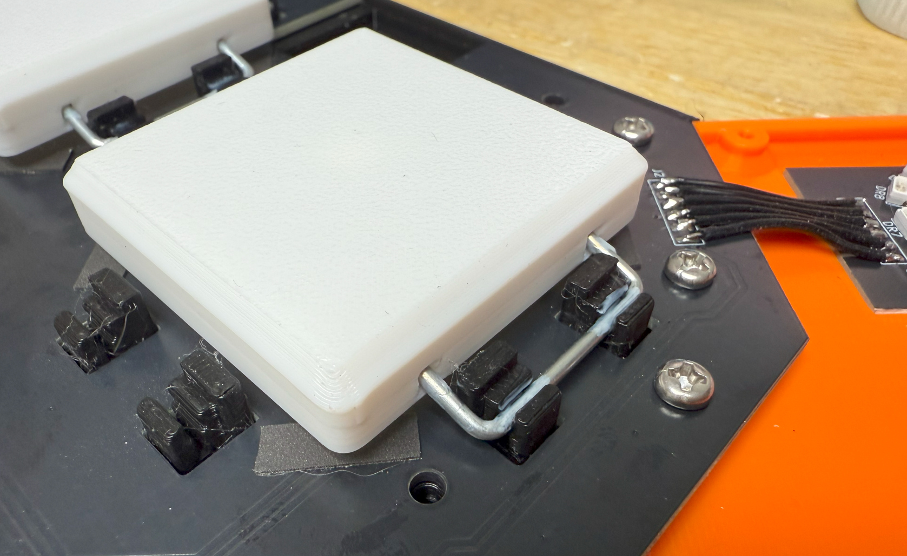 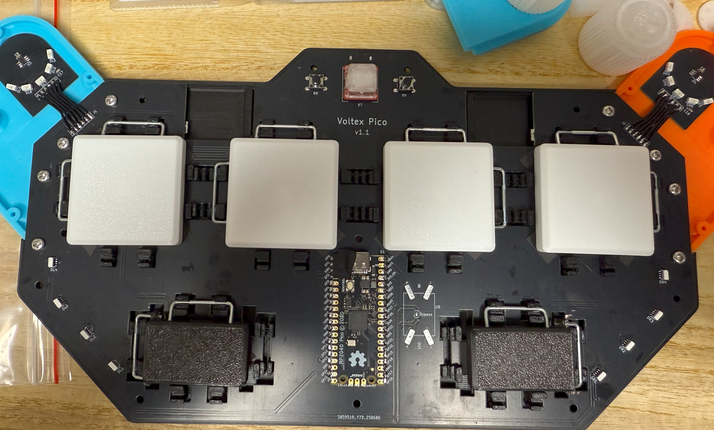

6. 装上支撑和面板。使用 M3\*(8mm-10mm) 螺丝固定底座，侧翼上的两颗先空着。

7. 装上侧翼盖（上面已经装了旋钮），使用 M2\*(8mm-10mm) 螺丝将它们固定（参见图片中的 M2 螺丝）。并在剩余的螺丝孔上使用 M3\*(8mm-10mm) 螺丝（每边一个）。贴上硅胶垫，它们不是很好看但可以防止控制器在桌上滑动。   
   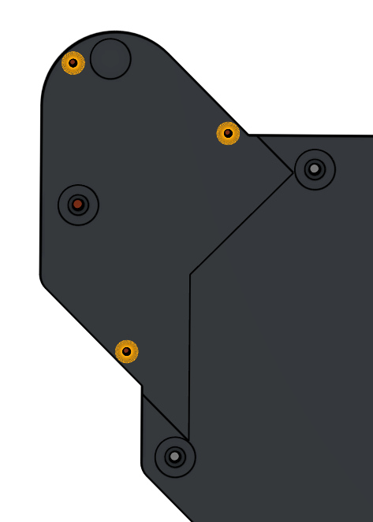 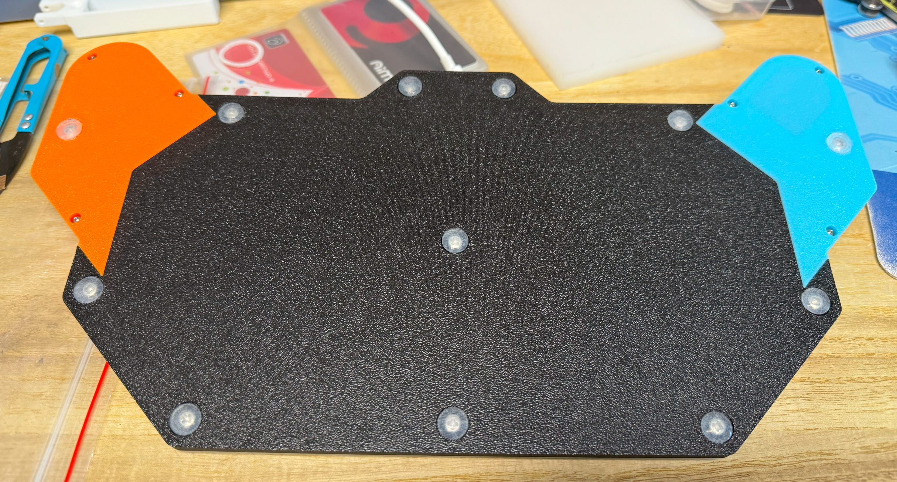
   
8. 恭喜！您已经完成了组装。  
   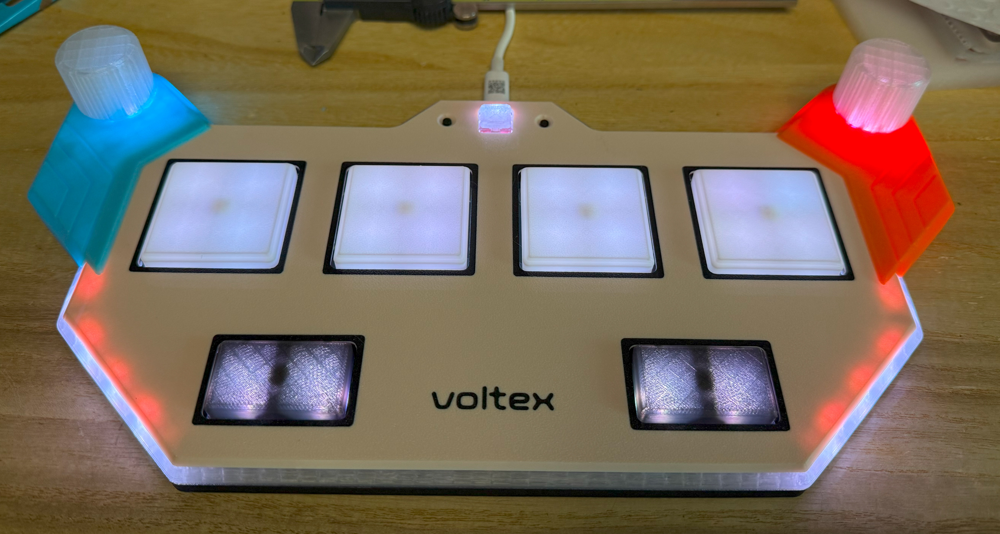

#### 注意事项
* 每台 3D 打印机和耗材都有自己的公差。如果您发现键帽上的孔太紧，使用针或刀将其稍微扩大一点。
* 螺丝很容易破坏 3D 打印部件。所以不要拧得太紧。当您注意到阻力突然增加时，停止拧螺丝。

### 固件
* UF2 文件在 `Production\Firmware` 文件夹中。
* 第一次烧写固件，请在连接 USB 到 PC 时按住 BOOTSEL 按钮，会出现一个名为"RPI-RP2"的磁盘。将 UF2 固件二进制文件拖入其中就好了。底面有一个小孔，它正对着 BOOTSEL 按钮。
* 如果它已经在运行 Voltex Pico 固件，您可以在命令行中使用"update"或在连接 USB 时按住至少 4 个按钮进入更新模式。
* 要访问命令行，您可以使用此 Web 串行终端连接到控制器的 USB 串行端口。（注意："?" 用于帮助）  
  https://googlechromelabs.github.io/serial-terminal/

### 使用方法
* 如果您构建了霍尔效应开关版本，您需要先校准（`calibrate` 命令）。您可以在命令行中设置触发和复位点。
* 只需插入并开始游戏。
* 您可以通过 `knob rate` 命令设置旋钮分辨率。
* 您可以通过 `trigger` 命令设置触发和复位点（仅限霍尔效应开关版本）。

## CAD 源文件
我使用的是 OnShape 的免费订阅，它很强大，但不能将原始设计存档到本地，所以我只能在这里分享链接。模型文件都是从这个在线文档导出的。  
  https://cad.onshape.com/documents/757c9485a30088ef0335481e/w/af98e079c47cba7d81086e65/e/9703cb81cc6ed9c6ec563897
