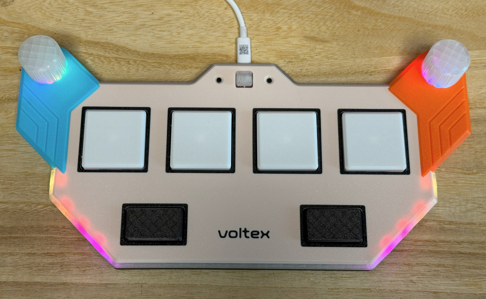

# Voltex Pico - Sound Voltex 风格的迷你控制器
[Click here for the English version of this guide.](README.md)

再等几天，还没写。

## CAD 源文件
我使用的是 OnShape 的免费订阅。它很强大，但不能将原始设计存档到本地，所以我只能在这里分享链接。STL/DXF/DWG 文件是从这个在线文档导出的。  
  https://cad.onshape.com/documents/757c9485a30088ef0335481e/w/af98e079c47cba7d81086e65/e/9703cb81cc6ed9c6ec563897
